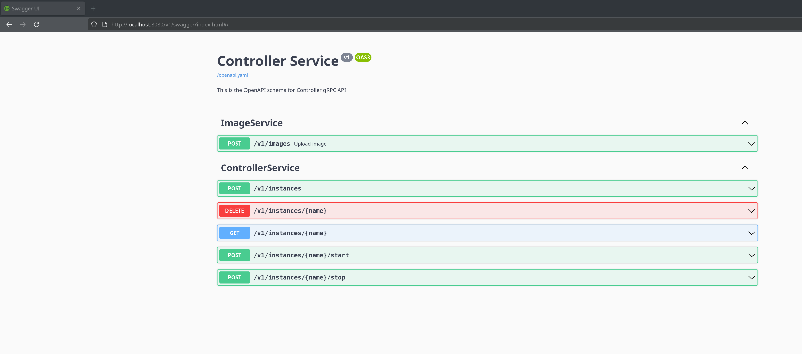

# QEMU VM Controller

**QEMU VM Controller** (or `qcontroller`) is a flexible, API-driven tool for managing QEMU-based virtual machine instances on Linux and macOS. It is designed for users who need precise control over VM networking, image management, and orchestration—whether for local development, testing, or reproducible infrastructure setups.

`qcontroller` provides a unified interface for four primary VM operations:

1. **Launch** – Create and optionally start a new VM from a known image.
2. **Start** – Resume a stopped VM.
3. **Stop** – Gracefully or forcefully stop a running VM.
4. **Info** – Query the status and configuration of a VM.

Operations are defined using [Protocol Buffers](/src/protos/) and exposed via both **gRPC** and a **RESTful HTTP gateway**, making integration with scripts, dashboards, or automation frameworks straightforward.

---


---

## ✨ Highlights

- 🛠 **Single static binary**: All logic is bundled into one Go binary with multiple subcommands.
- 🖥 **Cross-platform support**: Works on Linux and macOS (Intel tested; Apple Silicon supported via QEMU).
- 🧠 **Declarative VM descriptions**: Define VM specs via JSON configs matching Protobuf definitions.
- 📡 **gRPC + REST API**: Communicate via a structured protocol or plain HTTP—your choice.
- 📦 **Custom image support**: Upload and manage your own VM images via API.
- 📜 **Auto-generated OpenAPI schema**: Serves interactive API docs using [http-swagger](https://github.com/swaggo/http-swagger).
- 🧩 **Easily extendable**: Add support for snapshots, cloning, or additional QEMU flags with minimal effort.

---

## 🚀 Getting Started

### macOS Package Installation

For macOS users, we provide a convenient installer package that handles service setup automatically:

```bash
# Build the macOS package
./build-macos-pkg.sh

# Install the package (creates system services)
sudo installer -pkg build/qcontrollerd.pkg -target /
```

This will:
- Install `qcontrollerd` to `/usr/local/bin/`
- Create LaunchDaemon (system service) for QEMU
- Create LaunchAgent (user services) for controller and gateway
- Auto-start all services after installation

To uninstall:
```bash
sudo /usr/local/share/com.github.qcontroller.qcontrollerd/uninstall.sh
```

### Manual Build Instructions

To build the binary manually, run:

```bash
make install-tools
make
```

## Subcommands

The compiled binary provides the following subcommands:

* `qemu` – Thin wrapper for the QEMU system binary; handles actual VM process execution.
* `controller` – Manages VM lifecycle and communication via gRPC.
* `gateway` – Exposes REST endpoints mapped from gRPC via gRPC-Gateway.

> **Separation of Controller and QEMU**:
> It's important to note that the application was split into two  components: the controller and QEMU. This separation was necessary because the qemu command requires elevated privileges due to its use of networking features such as TAP on Linux and vmnet on macOS.
> To avoid granting elevated rights to the entire application, a minimal QEMU service was created. This service runs as root and is responsible solely for executing the qemu command. The controller, on the other hand, manages the virtual machine lifecycle and runs as a non-root user, ensuring a more secure and controlled execution environment.

### Running the App

#### Packaged Installation (macOS)
If you installed via the macOS package, services are automatically started and managed by launchd. Access the API at:
- Swagger UI: `http://localhost:8080/v1/swagger/index.html`

#### Manual Execution
Each subcommand expects a JSON configuration file matching its Protobuf [definitions](/src/protos/settings/v1/settings.proto).

All subcommands must run concurrently; orchestration (e.g., via `systemd` on Linux) is recommended. A [startup script](/start.sh) is provided to run all required components together:
```shell
bash start.sh -h
```

This command will start all three components:
- ➜ gateway: `http://localhost:8080`
- ➜ qemu: `0.0.0.0:8008`
- ➜ controller: `0.0.0.0:8009`

Then hit the REST API (e.g. using swagger ui, that is hosted at `http://localhost:8080/v1/swagger/index.html`):



## Example Base Image

This repo includes tooling to build a base Ubuntu Cloud image with the QEMU Guest Agent (QGA), compatible with qcontroller's QAPI integration.
Use [Packer](https://www.packer.io/) to build it:

```shell
packer init .
packer build .
```

Default values are configured for Linux on x86_64. If you're using a different platform, you'll need to adjust these settings. For example, on macOS with Apple Silicon, build the image using:

```shell
packer build -var arch=arm64 -var machine=virt -var accelerator=hvf .
```

See [qga](/qga/README.md) for details on building QGA.

## 📎 API Access

The gRPC gateway automatically generates a Swagger-compatible OpenAPI schema. A basic Swagger UI is served at:

```shell
http://localhost:8080/v1/swagger/index.html
```
All REST endpoints follow the schema defined in [/src/protos/](/src/protos/).

## 🧪 Development Setup

Use the provided [Dockerfile](/Dockerfile) to ensure a consistent dev environment.

To run commands inside the container:
```shell
./exec.sh make lint
```

This wraps the environment with all Go tools and build dependencies preinstalled.

## Build Dependencies

- `make` `git` `go` `protoc`
- Go plugins:
    - `protoc-gen-go` `protoc-gen-go-grpc`
    - [`buf`](https://github.com/bufbuild/buf)
    - [`protoc-gen-grpc-gateway`](https://github.com/grpc-ecosystem/grpc-gateway)
    - [`protoc-gen-openapi`](https://github.com/google/gnostic)
    - [`golangci-lint`](https://github.com/golangci/golangci-lint)

## Runtime Dependencies

- `qemu-system-x86_64` (x86_64 VMs are supported and tested)
- `qemu-system-aarch64` (ARM64 VMs are supported and tested)
