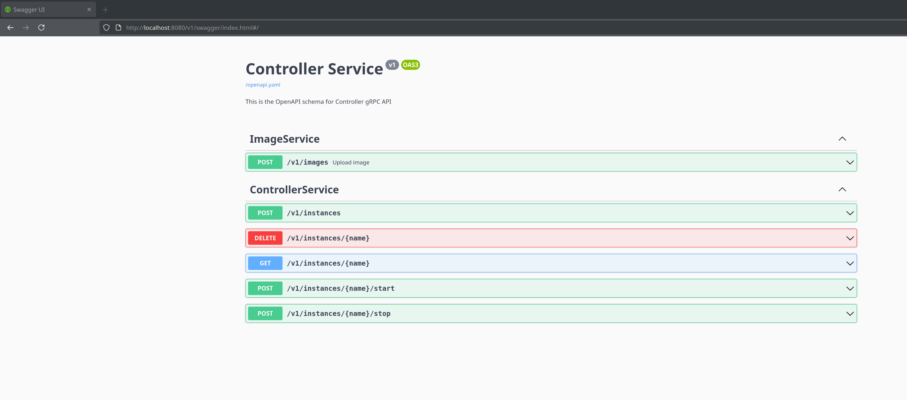

# QEMU VM Controller

**QEMU VM Controller** (or `qcontroller`) is a flexible, API-driven tool for managing QEMU-based virtual machine instances on Linux and macOS. It is designed for users who need precise control over VM networking, image management, and orchestration—whether for local development, testing, or reproducible infrastructure setups.

`qcontroller` provides a unified interface for VM operations:

1. **Create** – Create and optionally start a new VM from a known image, on any node.
2. **Start** – Resume a stopped VM (async — returns immediately, transitions via events).
3. **Stop** – Gracefully or forcefully stop a running VM.
4. **Remove** – Delete a VM and clean up its resources.
5. **Info** – Query the status, configuration, and runtime info of VMs.
6. **ListNodes** – List all configured nodes in the cluster.

Operations are defined using [Protocol Buffers](/src/protos/) and exposed via both **gRPC** and a **RESTful HTTP gateway**, making integration with scripts, dashboards, or automation frameworks straightforward.

The architecture separates node-level services from multi-node coordination. Each node runs `qemu`, `fileregistry`, `eventservice`, and `controller` — all communicating via gRPC on localhost. The `orchestrator` sits on top, providing a unified REST API, WebSocket event streaming, image distribution, and the web UI. This is the same architecture regardless of the number of nodes — even a single-node setup runs through the orchestrator.

---


---


---

## ✨ Highlights

- 🛠 **Single static binary**: All logic is bundled into one Go binary with multiple subcommands.
- 🖥 **Cross-platform support**: Works on Linux and macOS (Intel tested; Apple Silicon supported via QEMU).
- 🌐 **Multi-node support**: Manage VMs across multiple physical nodes from a single control plane.
- 🎯 **Modern web UI**: Full-featured React-based interface available at [qcontroller-ui](https://github.com/q-controller/qcontroller-ui).
- 🧠 **Declarative VM descriptions**: Define VM specs via JSON configs matching Protobuf definitions.
- 📡 **gRPC + REST API**: Communicate via a structured protocol or plain HTTP—your choice.
- **Real-time event streaming**: Live VM state changes via WebSocket at `/ws`, aggregated from all nodes by the orchestrator.
- **Automatic image distribution**: Orchestrator pushes images to remote nodes before VM creation.
- 📜 **Auto-generated OpenAPI schema**: Serves interactive API docs using [http-swagger](https://github.com/swaggo/http-swagger).
- 🧩 **Easily extendable**: Add support for snapshots, cloning, or additional QEMU flags with minimal effort.

---

## 🚀 Getting Started

### macOS Package Installation

For macOS users, we provide a convenient installer package that handles service setup automatically:

```bash
# Build the macOS package
./build-macos-pkg.sh

# Install the package (creates system services)
sudo installer -pkg build/qcontrollerd.pkg -target /
```

This will:
- Install `qcontrollerd` to `/usr/local/bin/`
- Create LaunchDaemon (system service) for QEMU
- Create LaunchAgent (user services) for controller and orchestrator
- Auto-start all services after installation

To uninstall:
```bash
sudo /usr/local/share/com.github.qcontroller.qcontrollerd/uninstall.sh
```

### Manual Build Instructions

To build the binary manually, run:

```bash
make install-tools
make
```

## Subcommands

The compiled binary provides the following subcommands:

* `qemu` – Manages VM process execution. Requires root for networking (TAP on Linux, vmnet on macOS).
* `controller` – Manages VM lifecycle on the local node. Polls QemuService for state changes and publishes them to the event service via gRPC.
* `eventservice` – Standalone pub/sub hub for VM and image events. Controllers and file registries publish events to it; the orchestrator subscribes.
* `orchestrator` – Coordinates multiple nodes. Subscribes to each node's event service, aggregates state, distributes images, and serves the REST API, WebSocket event stream, Swagger UI, and web frontend via gRPC-gateway.
* `fileregistry` – Manages VM image storage. Provides chunked upload/download via gRPC. Runs on each node and on the orchestrator.

> **Separation of Controller and QEMU**:
> The qemu service requires elevated privileges for networking (TAP/vmnet). To avoid granting root to the entire application, it runs as a separate process. The controller and other services run as non-root users.

> **Architecture**:
> Each node runs `qemu`, `fileregistry`, `eventservice`, and `controller` — all communicating via gRPC on localhost. The orchestrator connects to each node's controller, file registry, and event service via gRPC. Images are uploaded to the orchestrator and automatically pushed to nodes on demand. The same setup works for one node or many.

### Running the App

#### Packaged Installation (macOS)
If you installed via the macOS package, services are automatically started and managed by launchd. Access the API at:
- Web UI: `http://localhost:8080/ui/`
- Swagger UI: `http://localhost:8080/v1/swagger/index.html`

#### Manual Execution
Each subcommand expects a JSON configuration file matching its Protobuf [definitions](/src/protos/settings/v1/settings.proto).

A startup script is provided for running all services together during development:

```shell
./start.sh --rundir /tmp/qcontroller --bin ./build/qcontrollerd
```

Run `./start.sh --help` for full usage details (interface, CIDR, DHCP range, macOS mode).

To add remote nodes, edit the `nodes` array in the orchestrator config. Each node entry needs a `name`, `endpoint` (the node's controller gRPC address), and `fileRegistryEndpoint` (the node's file registry gRPC address).

For multi-node setups with overlay networking, see the helper scripts:
- [`setup-nebula.sh`](/setup-nebula.sh) — generates Nebula CA, certificates, and configs for two nodes
- [`setup-overlay.sh`](/setup-overlay.sh) — adds/removes nft forwarding rules between the QEMU bridge and the overlay interface

Default service ports:
- orchestrator: `http://localhost:8080` (HTTP)
- eventservice: `localhost:8011` (gRPC)
- controller: `localhost:8009` (gRPC)
- qemu: `localhost:8008` (gRPC)
- fileregistry: `localhost:8010` (gRPC)

Then access the interfaces:
- Web UI: `http://localhost:8080/ui/`
- Swagger UI: `http://localhost:8080/v1/swagger/index.html`



## Example Base Image

This repo includes tooling to build a base Ubuntu Cloud image with the QEMU Guest Agent (QGA), compatible with qcontroller's QAPI integration.
Use [Packer](https://www.packer.io/) to build it:

```shell
packer init .
packer build .
```

Default values are configured for Linux on x86_64. If you're using a different platform, you'll need to adjust these settings. For example, on macOS with Apple Silicon, build the image using:

```shell
packer build -var arch=arm64 -var machine=virt -var accelerator=hvf .
```

See [qga](/qga/README.md) for details on building QGA.

## 📎 API Access

The gRPC gateway automatically generates a Swagger-compatible OpenAPI schema. A basic Swagger UI is served at:

```shell
http://localhost:8080/v1/swagger/index.html
```

For real-time VM state updates, connect to the WebSocket endpoint:

```shell
ws://localhost:8080/ws
```

All REST endpoints follow the schema defined in [/src/protos/](/src/protos/). WebSocket messages use Protocol Buffers for efficient binary communication.

## 🧪 Development Setup

Use the provided [Dockerfile](/Dockerfile) to ensure a consistent dev environment.

To run commands inside the container:
```shell
./exec.sh make lint
```

This wraps the environment with all Go tools and build dependencies preinstalled.

## Build Dependencies

- `make` `git` `go` `protoc`
- Go plugins:
    - `protoc-gen-go` `protoc-gen-go-grpc`
    - [`buf`](https://github.com/bufbuild/buf)
    - [`protoc-gen-grpc-gateway`](https://github.com/grpc-ecosystem/grpc-gateway)
    - [`protoc-gen-openapi`](https://github.com/google/gnostic)
    - [`golangci-lint`](https://github.com/golangci/golangci-lint)

## Runtime Dependencies

- `qemu-system-x86_64` (x86_64 VMs are supported and tested)
- `qemu-system-aarch64` (ARM64 VMs are supported and tested)
